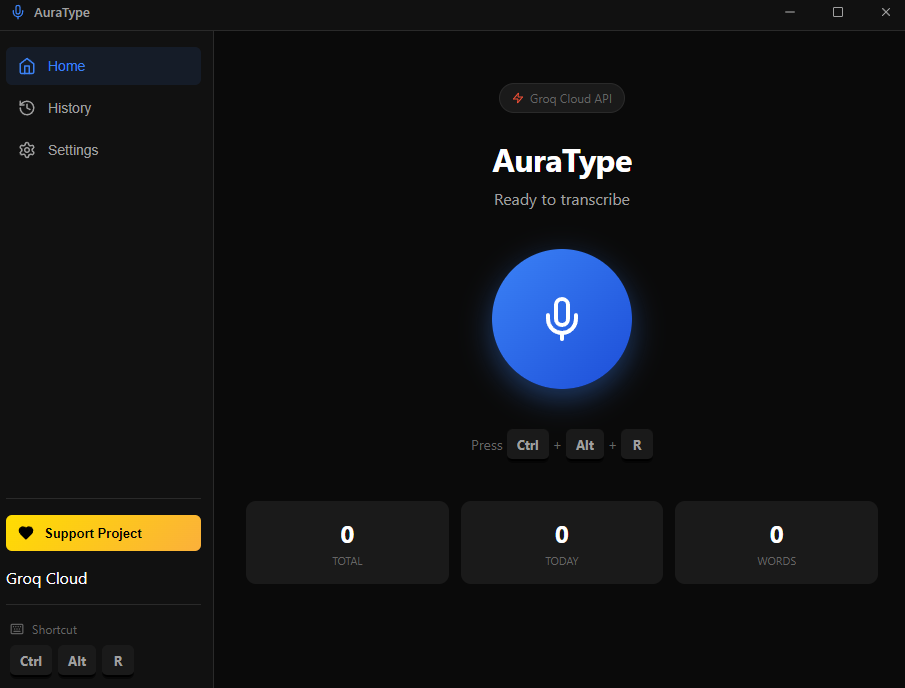

# AuraType ⚡

**AuraType** is a lightning-fast, privacy-first voice-to-text application for Windows. It allows you to transcribe your speech into any application instantly using global shortcuts.

Powered by [OpenAI Whisper](https://github.com/ggerganov/whisper.cpp) (Local) and [Groq Cloud](https://groq.com) (Cloud).

## ✨ Features

- **Global Shortcut**: Press `Ctrl + Alt + R` anywhere to start/stop recording.
- **Auto-Paste**: Transcribed text is automatically pasted into your active window (Word, Notepad, Slack, etc.).
- **Dual Mode Engine**:
  - **Local Whisper**: Runs entirely offline on your CPU/GPU. 100% Private. (Supports models: Tiny to Large-v3-Turbo).
  - **Groq Cloud**: Ultra-low latency transcription using Groq's LPU™ Inference Engine (Requires free API Key).
- **History Management**: View, search, copy, and delete past transcriptions.
- **Smart Overlay**: Minimalist visual feedback that floats on top of your screen while recording.
- **Clipboard Intelligence**: Preserves your clipboard content (images/text) even after auto-pasting.

## 🚀 Getting Started

### Prerequisites
- Windows 10/11
- Microphone

### Installation

1.  **Download the latest release** from the [Releases](https://github.com/kopa21/auratype/releases) page.
2.  Run the installer `AuraType-Setup-1.0.0.exe`.
3.  Launch the app.

### Setup Guide

#### Option A: Local Mode (Private & Free)
1.  Go to **Settings** -> Select **Local Whisper**.
2.  Click **Manage Models**.
3.  Follow the setup wizard:
    *   **Step 1**: Download the `whisper.cpp` binary (link provided in-app) and place it in the opened folder.
    *   **Step 2**: Download a model (Recommended: `Large-v3-Turbo` for best speed/accuracy balance).
4.  You're ready!

#### Option B: Groq Cloud (Instant Speed)
1.  Go to **Settings** -> Select **Groq Cloud API**.
2.  Get a free API Key from [console.groq.com](https://console.groq.com/keys).
3.  Paste the key into AuraType.
4.  Done!

## ⌨️ Shortcuts

| Shortcut | Action |
|----------|--------|
| `Ctrl + Alt + R` | Start / Stop Recording |

## 🛠️ Tech Stack

*   **Electron**: Desktop framework
*   **React + Vite**: UI Frontend
*   **Whisper.cpp**: Local inference engine (C++)
*   **Groq API**: Cloud inference
*   **AudioWorklet**: Low-latency audio capture

## ❤️ Support the Project

If you love AuraType and it helps your workflow, consider buying me a coffee!

---

**Author**: [kopa]([https://github.com/kopa21](https://github.com/b0korpat))
**License**: MIT
